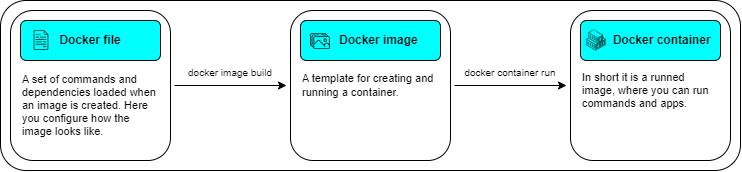

# Docker run app
[](https://skillicons.dev)

In this section we will take a closer look at the:
1. [Running the application using the Docker file](#step-1---running-the-application-using-the-docker-file)
2. [Running the application with a volume for data storing](#step-2---running-the-application-with-a-volume-for-data-storing)
3. [Running the application using the Docker compose file](#step-3---running-the-application-using-the-docker-compose-file)

## Info
### Order 
In this section, we will focus on how to use the Docker file and compose file to run our web application, we also learn how to create a volume for storing data generated by the web application
* If you are intresting in Powershell only, look at this [file](DockerRunApp.ps1)
* Of course to check all new objects you can simply use the Docker Desktop application
* I only show necessary informations about the Docker container and image because there are plenty of articles on the web

</br>
<details>
<summary> Brief ports informations</summary>

| Port      | Protocol |
| --------- | -------- |
| 20/21     | (FTP) File Transfer Protocol |
| 2         | (SSH) Secure Shell |
| 80        | (HTTP) Hypertext Transfer Protocol |
| 443       | (HTTPS) Hypertext Transfer Protocol over SSL/TLS |
| 5000      | It is a port for Flask development server and several other applications |

</details>

### Docker 
* **What is Docker?** Docker is a tool which allows you to create a running environment caontaining any Linux distribution and all dependencies needed in your application. More information in the [official documentation](https://docs.docker.com/guides/docker-overview/) 
* **What is Docker image?** This is build for run environment. You can create it from Docker file where you set dependencies, ports and so on. If you want to share Docker project with someone, you are using Docker image to achive this. More information in the [official documentation](https://docs.docker.com/guides/docker-overview/#images) 
* **What is Docker container?** This is running environment for our project. Inside of this you can run commands to launch previously written applications. You must create Docker image to run Docker container. In short, a container is a running image. More information in the [official documentation](https://docs.docker.com/guides/docker-overview/#containers) 

</br>

<details>
<summary> Docker objects - essential information</summary>
</br>



</details>

<details>
<summary> Docker commands - official documentation for every command used in this section</summary>
</br>

* Images
    * [docker image build](https://docs.docker.com/reference/cli/docker/image/build/)
    * [docker image ls](https://docs.docker.com/reference/cli/docker/image/ls/)
    * [docker image remove](https://docs.docker.com/reference/cli/docker/image/rm/)
* Containers
    * [docker container run](https://docs.docker.com/reference/cli/docker/container/run/)
    * [docker container ls](https://docs.docker.com/reference/cli/docker/container/ls/)
    * [docker container stop](https://docs.docker.com/reference/cli/docker/container/stop/)
* Volumes
    * [docker volume create](https://docs.docker.com/reference/cli/docker/volume/create/)
    * [docker volume ls](https://docs.docker.com/reference/cli/docker/volume/ls/)
    * [docker volume remove](https://docs.docker.com/reference/cli/docker/volume/rm/)
* Compose 
    * [docker compose](https://docs.docker.com/reference/cli/docker/compose/)

</details>
</br>

<details>
<summary> Parameters - docker image build </summary>


| Parameter | Value                 | Description |
| --------- | -----                 | ----------- |
| --rm      | _switch_              | Removing intermediate containers after a successful build |
| --pull    | _switch_              | Always attempt to pull a newer version of the image |
| --tag     | {name:tag}            | Image name, it can't contains large characters |
| --file    | {path_to_docker_file} | Build image using a specified Dockerfile  |
| PATH      | .                     | This parameter specifies where to find the files for the "context" of the build on the Docker daemon |

</details>

<details>
<summary> Parameters - docker container run </summary>

| Parameter     | Value                 | Description |
| ---------     | -----                 | ----------- |
| --rm          | _switch_              | Use it if you'd like Docker to automatically clean up the container and remove the file system when the container exits |
| --detach      | _switch_              | Running container in detach mode and return container id |
| --name        | {name}                | Container name, it can't contains large characters |
| --publish     | {port/protocol}       | This parameter bind container port 5000 to TCP port 5000 of the host |
| IMAGE_NAME    | {image_name}          | This parameter specifies where to find the files for the "context" of the build on the Docker daemon |

</details>

<details>
<summary> Parameters - docker container run volume </summary>

| Parameter     | Value                         | Description |
| ---------     | -----                         | ----------- |
| --volume      | {volume_name}:{folderPath}    | Use this parameter to attach a volume to a container and specify the folder path to copy to the volume |

</details>

<details>
<summary> Parameters - docker compose </summary>

| Parameter         | Value         | Description |
| ---------         | -----         | ----------- |
| --file            | {filePath}    | Docker compose file path |
| --project-name    | {name}        | Project name created from compose file |
| --detach          | _switch_      | Run in detach mode |

</details>


## Steps

### Step 1 - Running the application using the Docker file

1. Run Powershell terminal and Docker desktop

2. Move to repo location

```powershell
Set-Location "your\repository\path"

# RETURNS: null
```

3. Build Docker image

```powershell
docker image build --rm --pull --tag docker-run-app:v1 --file dockerfile .

# RETURNS: Informations about building process
```

4. Run Docker container

```powershell
docker container run --rm --detach --name docker-run-app --publish 5000:5000/tcp docker-run-app:v1

# RETURNS: e804bc08a506d30faed022005dafd4ca27d3e286a9aa4f1dd0ee50b8c0ace3ad
# INFO: Random generated container id
```

5. Check if our image exists, so print all images

```powershell
docker image ls

# RETURNS: All images with properties
```

6. You can print only our image too 

```powershell
docker image ls docker-run-app

# RETURNS:
# REPOSITORY       TAG       IMAGE ID       CREATED        SIZE
# docker-run-app   v1        4cc7737f1883   15 hours ago   167MB

# INFO: Image properties
```

7. Check if our container exists

```powershell
docker container ls

# RETURNS: 
# CONTAINER ID   IMAGE               COMMAND                  CREATED         STATUS         PORTS                    NAMES
# e804bc08a506   docker-run-app:v1   "gunicorn --bind 0.0…"   6 minutes ago   Up 6 minutes   0.0.0.0:5000->5000/tcp   docker-run-app

# INFO: Container properties
```

8. Open app at http://localhost:5000/
    - check http://localhost:5000/read - reading the [data file](../FirstLook/App/data/data.txt)
    - check http://localhost:5000/append - adding simple message to the [data file](../FirstLook/App/data/data.txt)
    - check http://localhost:5000/read again - as you can see there is a new message 

9. Alright, if everything is fine let's stop our container. We don't remove the image because we will need it later

```powershell
docker container stop docker-run-app

# RETURNS: docker-run-app
# INFO: Container name 
```

### Step 2 - Running the application with a volume for data storing

1. Firstly let's create a volume

```powershell
docker volume create docker-run-app-volume

# RETURNS: docker-run-app-volume
# INFO: Volume name 
```

2. Check existed volumes. If there is our created volume, we can go further

```powershell
docker volume ls

# RETURNS: 
# DRIVER    VOLUME NAME
# local     docker-run-app-volume

# INFO: List of volumes with properties 
```

3. Now let's run container with created volume

```powershell
docker container run --rm --detach --name docker-run-app --publish 5000:5000/tcp --volume docker-run-app-volume:/app/data docker-run-app:v1

# RETURNS: c3c852a0caeaf6b73e3ec55a438b4fb89460376d641bfb032499d78b823cc493
# INFO: Container id
```

4. As you can see at the http://localhost:5000/read address only one message occurs, because when we created previous container we didn't use volume, thus Docker didn't store any data. 

5. Now we are using volume in our container so we can add few messages to our "datastore". Open and refresh http://localhost:5000/append few times

6. Check there is new messages at http://localhost:5000/read

7. Remove container

```powershell
docker container stop docker-run-app

# RETURNS: docker-run-app
# INFO: Container name 
```

8. Create container one more time

```powershell
docker container run --rm --detach --name docker-run-app --publish 5000:5000/tcp --volume docker-run-app-volume:/app/data docker-run-app:v1

# RETURNS: c3c852a0caeaf6b73e3ec55a438b4fb89460376d641bfb032499d78b823cc493
# INFO: Container id
```

9. Look at the http://localhost:5000/read address. Do you see? Here is the same amount of messages as before, because of using volume which storing data for us.

10. At the end, let's remove container, volume and image

```powershell
docker container stop docker-run-app
docker volume remove docker-run-app-volume
docker image remove docker-run-app:v1
```

### Step 3 - Running the application using the Docker compose file

1. Take a look at [docker compose file](../docker-compose.yaml) and read it. Creating containers with compose files is much more easier than using docker commands, because we have everything in one compose file. 

2. Create volume

```powershell
docker volume create docker-run-app-volume

# RETURNS: docker-run-app-volume
# INFO: Volume name 
```

3. Run compose file

```powershell
docker compose --file docker-compose.yaml --project-name docker-run-app-compose up --detach

# RETURNS: Informations about building process
```

4. If everything is fine there should be:
    * created image `docker image ls docker-run-app`
    * running container `docker container ls`
    * available app at http://localhost:5000

5. Stop container created by compose file

```powershell
docker compose --project-name docker-run-app-compose down

# RETURNS: Informations about removing process
```

6. Remove image and volume

```powershell
docker volume remove docker-run-app-volume
docker image remove docker-run-app:v1
```
